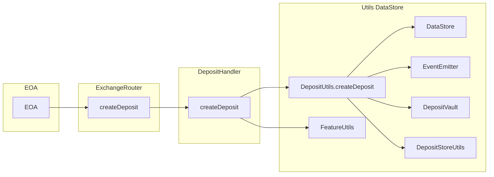
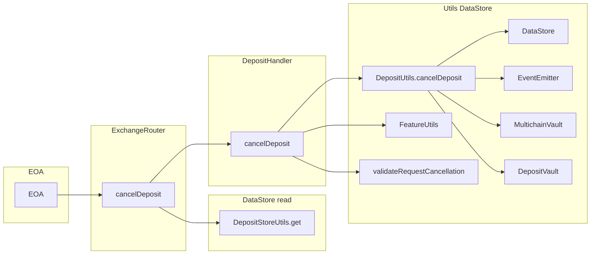
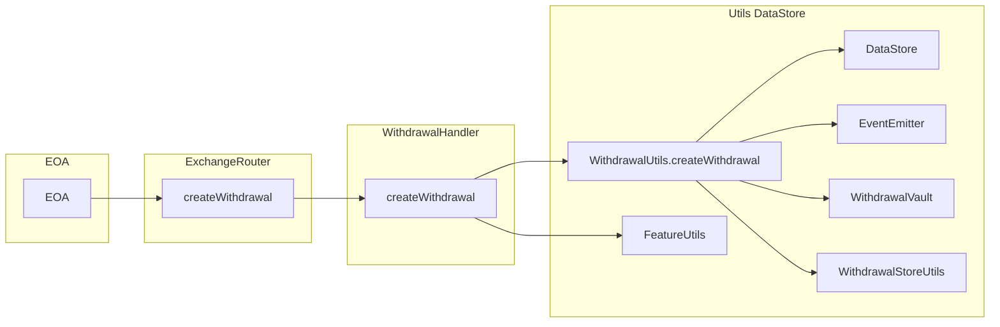
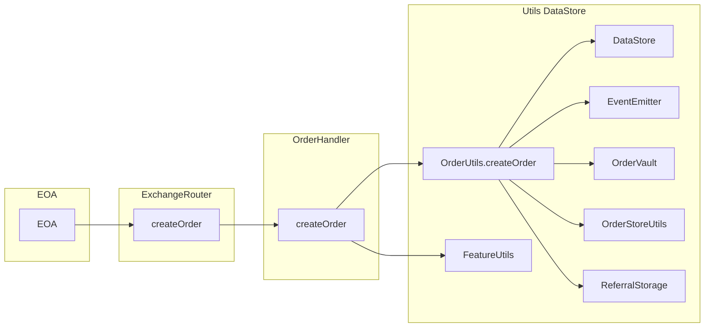
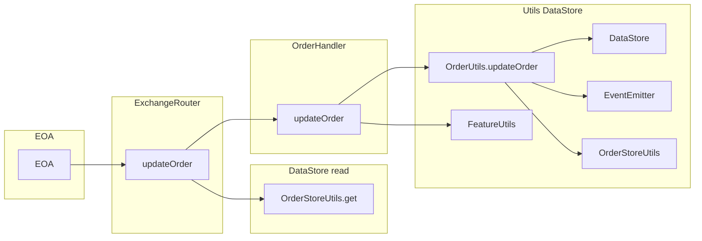
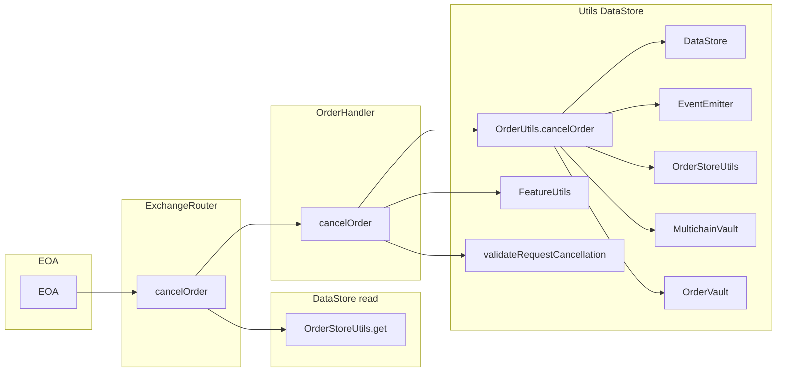
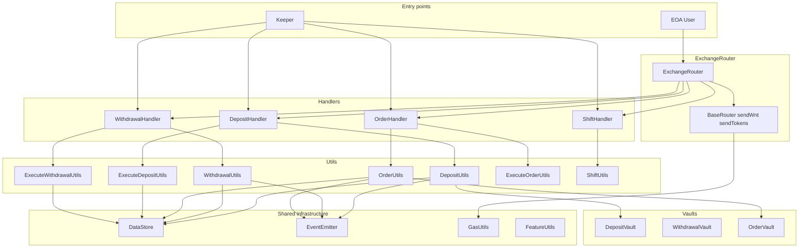

# Call routes: LP, user, keeper, and multicall flows

This document shows the **route taken** for ExchangeRouter and Handler entry points: **LPs** (deposits/withdrawals), **users** (positions), **keepers** (execute*), and **multicall** (sendWnt/sendTokens + createDeposit/createOrder). User flows go **EOA → ExchangeRouter → Handler → Utils**. Keeper flows go **Keeper → Handler** (direct, no router). Execution uses `onlyOrderKeeper` + `withOraclePrices`.

---

## LP flows

### 1. `createDeposit()`

**Flow:** User/LP calls `ExchangeRouter.createDeposit(params)` (e.g. via multicall with `sendWnt`/`sendTokens`). Router forwards to `DepositHandler.createDeposit`, which writes the deposit via `DepositUtils.createDeposit` and uses `DataStore`, `EventEmitter`, `DepositVault`.



**Steps:**

| Step | Contract / component | Action |
|------|----------------------|--------|
| 1 | `ExchangeRouter` | `createDeposit(params)` — `msg.sender` as account, then `depositHandler.createDeposit(account, 0, params)` |
| 2 | `DepositHandler` | Modifiers: `globalNonReentrant`, `onlyController`. `FeatureUtils.validateFeature`, `validateDataListLength`, then `DepositUtils.createDeposit(dataStore, eventEmitter, depositVault, account, srcChainId, params)` |
| 3 | `DepositUtils` | Writes deposit to `DataStore` via `DepositStoreUtils`, emits events via `EventEmitter`, handles vault/collateral |

---

### 2. `cancelDeposit()`

**Flow:** User calls `ExchangeRouter.cancelDeposit(key)`. Router loads deposit with `DepositStoreUtils.get`, checks `msg.sender` is account, then calls `DepositHandler.cancelDeposit(key)`.



**Steps:**

| Step | Contract / component | Action |
|------|----------------------|--------|
| 1 | `ExchangeRouter` | `DepositStoreUtils.get(dataStore, key)`; revert if empty or `deposit.account() != msg.sender`; then `depositHandler.cancelDeposit(key)` |
| 2 | `DepositHandler` | `globalNonReentrant`, `onlyController`; `FeatureUtils.validateFeature`, `validateRequestCancellation`; then `DepositUtils.cancelDeposit(...)` with `Keys.USER_INITIATED_CANCEL` |
| 3 | `DepositUtils` | Updates `DataStore`, emits events, handles `MultichainVault` / `DepositVault` |

---

### 3. `createWithdrawal()`

**Flow:** User calls `ExchangeRouter.createWithdrawal(params)`. Router forwards to `WithdrawalHandler.createWithdrawal`, which uses `WithdrawalUtils.createWithdrawal` and DataStore / EventEmitter / WithdrawalVault.



**Steps:**

| Step | Contract / component | Action |
|------|----------------------|--------|
| 1 | `ExchangeRouter` | `createWithdrawal(params)` — `msg.sender` as account, then `withdrawalHandler.createWithdrawal(account, 0, params)` |
| 2 | `WithdrawalHandler` | `globalNonReentrant`, `onlyController`; `FeatureUtils.validateFeature`, `validateDataListLength`; then `WithdrawalUtils.createWithdrawal(dataStore, eventEmitter, withdrawalVault, account, srcChainId, params, false)` |
| 3 | `WithdrawalUtils` | Writes withdrawal to `DataStore` via `WithdrawalStoreUtils`, emits events, interacts with `WithdrawalVault` |

---

## User (positions) flows

### 4. `createOrder()`

**Flow:** User calls `ExchangeRouter.createOrder(params)` (often via multicall with `sendWnt`/`sendTokens`). Router forwards to `OrderHandler.createOrder`, which uses `OrderUtils.createOrder` and DataStore / EventEmitter / OrderVault / ReferralStorage.



**Steps:**

| Step | Contract / component | Action |
|------|----------------------|--------|
| 1 | `ExchangeRouter` | `createOrder(account, srcChainId, params, shouldCapMaxExecutionFee)` — typically `msg.sender` as account; then `orderHandler.createOrder(account, 0, params, ...)` |
| 2 | `OrderHandler` | `globalNonReentrant`, `onlyController`; `FeatureUtils.validateFeature` (createOrder per order type), `validateDataListLength`; then `OrderUtils.createOrder(dataStore, eventEmitter, orderVault, referralStorage, account, srcChainId, params, shouldCapMaxExecutionFee)` |
| 3 | `OrderUtils` | Validates account, writes order via `OrderStoreUtils`, emits events, handles `OrderVault` and referral logic |

---

### 5. `updateOrder()`

**Flow:** User calls `ExchangeRouter.updateOrder(key, sizeDeltaUsd, acceptablePrice, triggerPrice, ...)`. Router loads order (for auth), then calls `OrderHandler.updateOrder`, which uses `OrderUtils.updateOrder` and DataStore / EventEmitter / OrderStoreUtils.



**Steps:**

| Step | Contract / component | Action |
|------|----------------------|--------|
| 1 | `ExchangeRouter` | Loads order (e.g. for auth); reverts if `order.account() != msg.sender`; then `orderHandler.updateOrder(key, sizeDeltaUsd, acceptablePrice, triggerPrice, ...)` |
| 2 | `OrderHandler` | `globalNonReentrant`, `onlyController`; `FeatureUtils.validateFeature` (updateOrder per order type); validations (e.g. not market order, updatable); then `OrderUtils.updateOrder(...)` |
| 3 | `OrderUtils` | Updates order in `DataStore` via `OrderStoreUtils`, emits `OrderUpdated`, may adjust execution fee |

---

### 6. `cancelOrder()`

**Flow:** User calls `ExchangeRouter.cancelOrder(key)`. Router loads order (for auth), then calls `OrderHandler.cancelOrder`, which uses `OrderUtils.cancelOrder` and DataStore / EventEmitter / OrderStoreUtils / MultichainVault / OrderVault.



**Steps:**

| Step | Contract / component | Action |
|------|----------------------|--------|
| 1 | `ExchangeRouter` | Loads order; reverts if empty or `order.account() != msg.sender`; then `orderHandler.cancelOrder(key)` |
| 2 | `OrderHandler` | `globalNonReentrant`, `onlyController`; `FeatureUtils.validateFeature`, `validateRequestCancellation`; then `OrderUtils.cancelOrder(...)` |
| 3 | `OrderUtils` | Updates `DataStore`, emits events, handles refunds / `MultichainVault` / `OrderVault` |

---

## Summary table

| Entry point | Router → Handler | Handler → Utils / DataStore |
|-------------|------------------|-----------------------------|
| **createDeposit** | `depositHandler.createDeposit` | `DepositUtils.createDeposit` → DataStore, EventEmitter, DepositVault, DepositStoreUtils |
| **cancelDeposit** | `DepositStoreUtils.get` then `depositHandler.cancelDeposit` | `DepositUtils.cancelDeposit` → DataStore, EventEmitter, MultichainVault, DepositVault |
| **createWithdrawal** | `withdrawalHandler.createWithdrawal` | `WithdrawalUtils.createWithdrawal` → DataStore, EventEmitter, WithdrawalVault, WithdrawalStoreUtils |
| **createOrder** | `orderHandler.createOrder` | `OrderUtils.createOrder` → DataStore, EventEmitter, OrderVault, OrderStoreUtils, ReferralStorage |
| **updateOrder** | (order loaded for auth) then `orderHandler.updateOrder` | `OrderUtils.updateOrder` → DataStore, EventEmitter, OrderStoreUtils |
| **cancelOrder** | (order loaded for auth) then `orderHandler.cancelOrder` | `OrderUtils.cancelOrder` → DataStore, EventEmitter, OrderStoreUtils, MultichainVault, OrderVault |

All six are **user/EOA entry points** on `ExchangeRouter`.

---

## multicall() — batch user actions

**Flow:** User calls `ExchangeRouter.multicall(bytes[] data)` with encoded calls. Each call is `delegatecall`ed to the router, so `msg.sender` stays the user. Common pattern: `[sendWnt(depositVault, amount), createDeposit(params)]` or `[sendTokens(...), createOrder(...)]`.

**Call route:**

```
EOA
  → ExchangeRouter.multicall(data)
      → delegatecall each data[i] to self
          → sendWnt(receiver, amount)
              → BaseRouter.sendWnt
              → TokenUtils.depositAndSendWrappedNativeToken
          → sendTokens(token, receiver, amount)
              → BaseRouter.sendTokens
              → router.pluginTransfer
          → createDeposit(params)   (see createDeposit above)
          → createOrder(params)     (see createOrder above)
          → createWithdrawal(params)
          → cancelDeposit(key)
          → ... (any other router function)
```

**Note:** `msg.value` is shared across all delegatecalls in a single multicall.

---

## Keeper flows — execute* (onlyOrderKeeper)

Keepers call **Handler** contracts directly (not via ExchangeRouter). All require `onlyOrderKeeper` and `withOraclePrices(oracleParams)`.

### 7. `DepositHandler.executeDeposit()`

**Call route:**

```
Keeper
  → DepositHandler.executeDeposit(key, oracleParams)
  → GasUtils (estimate, validate, getExecutionGas)
  → _executeDeposit (try/call with gas)
  → ExecuteDepositUtils.executeDeposit
      → MarketUtils, DepositVault, DataStore, EventEmitter, ...
```

---

### 8. `WithdrawalHandler.executeWithdrawal()`

**Call route:**

```
Keeper
  → WithdrawalHandler.executeWithdrawal(key, oracleParams)
  → GasUtils
  → _executeWithdrawal (try/call with gas)
  → ExecuteWithdrawalUtils.executeWithdrawal
      → MarketUtils, WithdrawalVault, DataStore, EventEmitter, SwapUtils, ...
```

---

### 9. `OrderHandler.executeOrder()`

**Call route:**

```
Keeper
  → OrderHandler.executeOrder(key, oracleParams)
  → doExecuteOrder
  → getOrderExecutor (Increase / Decrease / Swap executor)
  → ExecuteOrderUtils.executeOrder
      → OrderUtils, PositionUtils, MarketUtils, DataStore, EventEmitter, ...
```

---

### 10. `ShiftHandler.executeShift()`

**Call route:**

```
Keeper
  → ShiftHandler.executeShift(key, oracleParams)
  → _executeShift (try/call with gas)
  → ShiftUtils.executeShift
      → ExecuteDepositUtils, ExecuteWithdrawalUtils, DataStore, EventEmitter, ...
```

---

### 11. `executeAtomicWithdrawal()` — user + oracle in one tx

**Flow:** User calls `ExchangeRouter.executeAtomicWithdrawal(params, oracleParams)` — user supplies oracle params, so create + execute happen in one transaction.

**Call route:**

```
EOA
  → ExchangeRouter.executeAtomicWithdrawal(params, oracleParams)
  → WithdrawalHandler.executeAtomicWithdrawal
  → WithdrawalUtils.createWithdrawal
  → ExecuteWithdrawalUtils.executeWithdrawal
```

---

### 12. GLV and JitOrder handlers (keeper-only)

- **GlvDepositHandler.executeGlvDeposit** — `onlyOrderKeeper`, `withOraclePrices`
- **GlvWithdrawalHandler.executeGlvWithdrawal** — `onlyOrderKeeper`, `withOraclePrices`
- **GlvShiftHandler.executeGlvShift** — `onlyOrderKeeper`
- **JitOrderHandler.executeJitOrder** — `onlyOrderKeeper`, `withOraclePrices` (create+execute in one)

---

## Summary — keeper vs user

| Who | Entry | Modifier | Purpose |
|-----|-------|----------|---------|
| **User** | ExchangeRouter.createDeposit, createOrder, ... | — | Create/cancel requests |
| **User** | ExchangeRouter.multicall([sendWnt, createDeposit]) | — | Batch: fund + create in one tx |
| **User** | ExchangeRouter.executeAtomicWithdrawal | — | Create + execute withdrawal with own oracle params |
| **Keeper** | DepositHandler.executeDeposit | onlyOrderKeeper, withOraclePrices | Execute pending deposit |
| **Keeper** | WithdrawalHandler.executeWithdrawal | onlyOrderKeeper, withOraclePrices | Execute pending withdrawal |
| **Keeper** | OrderHandler.executeOrder | onlyOrderKeeper, withOraclePrices | Execute pending order |
| **Keeper** | ShiftHandler.executeShift | onlyOrderKeeper, withOraclePrices | Execute pending shift |

---

## Conclusion — all contracts utilized

The following contracts are used across the LP, user, multicall, and keeper flows documented above.

### Routers and base

| Contract | Role |
|----------|------|
| **ExchangeRouter** | Main user entry; createDeposit, cancelDeposit, createWithdrawal, createOrder, updateOrder, cancelOrder, executeAtomicWithdrawal, multicall |
| **BaseRouter** | sendWnt, sendTokens, sendNativeToken (inherited by ExchangeRouter) |
| **PayableMulticall** | multicall(bytes[]) via delegatecall |
| **Router** | pluginTransfer for sendTokens |

### Handlers (exchange/)

| Contract | Role |
|----------|------|
| **DepositHandler** | createDeposit, cancelDeposit, executeDeposit, executeDepositFromController |
| **WithdrawalHandler** | createWithdrawal, cancelWithdrawal, executeWithdrawal, executeAtomicWithdrawal, executeWithdrawalFromController |
| **OrderHandler** | createOrder, updateOrder, cancelOrder, executeOrder |
| **ShiftHandler** | createShift, cancelShift, executeShift, executeShiftFromController |
| **GlvDepositHandler** | createGlvDeposit, cancelGlvDeposit, executeGlvDeposit |
| **GlvWithdrawalHandler** | createGlvWithdrawal, cancelGlvWithdrawal, executeGlvWithdrawal |
| **GlvShiftHandler** | createGlvShift, executeGlvShift |
| **JitOrderHandler** | executeJitOrder |
| **ExternalHandler** | makeExternalCalls (used from multicall) |

### Store utils and data

| Contract | Role |
|----------|------|
| **DataStore** | Key-value storage for deposits, withdrawals, orders, shifts, config |
| **DepositStoreUtils** | Read/write deposits |
| **WithdrawalStoreUtils** | Read/write withdrawals |
| **OrderStoreUtils** | Read/write orders |
| **ShiftStoreUtils** | Read/write shifts |
| **Keys** | DataStore key constants |

### Utils (libraries)

| Contract | Role |
|----------|------|
| **DepositUtils** | createDeposit, cancelDeposit logic |
| **ExecuteDepositUtils** | executeDeposit logic |
| **WithdrawalUtils** | createWithdrawal, cancelWithdrawal logic |
| **ExecuteWithdrawalUtils** | executeWithdrawal logic |
| **OrderUtils** | createOrder, updateOrder, cancelOrder logic |
| **ExecuteOrderUtils** | executeOrder logic |
| **ShiftUtils** | executeShift logic |
| **TokenUtils** | depositAndSendWrappedNativeToken, sendNativeToken |
| **AccountUtils** | validateAccount, validateReceiver |
| **FeatureUtils** | validateFeature (feature flags) |
| **GasUtils** | estimateExecuteDepositGasLimit, validateExecutionGas, getExecutionGas |
| **MarketUtils** | Market operations used by ExecuteDepositUtils, ExecuteWithdrawalUtils |
| **PositionUtils** | Position operations used by ExecuteOrderUtils |
| **SwapUtils** | Swap logic (withdrawals, shifts) |
| **ReferralUtils** | Referral logic in OrderUtils |
| **NonceUtils** | Nonce / key generation |
| **CallbackUtils** | Callback invocation |
| **ErrorUtils** | revertWithParsedMessage |
| **OracleUtils** | Price validation, SetPricesParams |

### Vaults

| Contract | Role |
|----------|------|
| **DepositVault** | Holds deposit collateral |
| **WithdrawalVault** | Holds withdrawal cash |
| **OrderVault** | Holds order collateral |
| **ShiftVault** | Holds shift amounts |
| **MultichainVault** | Multichain bridging |

### Core infrastructure

| Contract | Role |
|----------|------|
| **EventEmitter** | Emits events for all actions |
| **RoleStore** | Access control (onlyOrderKeeper, onlyController) |
| **Oracle** | Price oracle for execution |

### Order executors (used by OrderHandler.executeOrder)

| Contract | Role |
|----------|------|
| **IncreaseOrderExecutor** | Increase-order execution |
| **DecreaseOrderExecutor** | Decrease-order execution |
| **SwapOrderExecutor** | Swap-order execution |

### Dependencies (interfaces / external)

| Contract | Role |
|----------|------|
| **IReferralStorage** / **ReferralStorage** | Referral data for OrderUtils |
| **ISwapHandler** / **SwapHandler** | Swap execution for withdrawals/shifts |
| **Router** | pluginTransfer |

### Extended conclusion — count and interfaces

**Total count:** 51 contracts + 31 interfaces = **82** artifacts used across the documented LP, user, multicall, and keeper flows.

#### Contract count by role

| Role | Count |
|------|-------|
| Routers and base | 4 |
| Handlers (exchange/) | 9 |
| Store utils and data | 6 |
| Utils (libraries) | 19 |
| Vaults | 5 |
| Core infrastructure | 3 |
| Order executors | 3 |
| Dependencies | 2 |
| **Total contracts** | **51** |

#### Interfaces used in these flows

| Interface | Used by |
|-----------|---------|
| **IExchangeRouter** | ExchangeRouter |
| **IDepositHandler**, **IWithdrawalHandler**, **IShiftHandler**, **IOrderHandler** | ExchangeRouter |
| **IExternalHandler**, **IJitOrderHandler** | ExchangeRouter |
| **IDepositUtils**, **IExecuteDepositUtils** | DepositHandler |
| **IWithdrawalUtils**, **IExecuteWithdrawalUtils** | WithdrawalHandler |
| **IBaseOrderUtils** | OrderHandler |
| **IShiftUtils** | ShiftHandler, ExchangeRouter |
| **ISwapHandler** | DepositHandler, WithdrawalHandler, OrderHandler |
| **ISwapPricingUtils** | WithdrawalHandler |
| **IOrderExecutor** | OrderHandler |
| **IReferralStorage** | OrderHandler |
| **IOracle** | Handlers |
| **IMultichainTransferRouter** | DepositHandler, GlvWithdrawalHandler |
| **IGlvDepositHandler**, **IGlvDepositUtils** | GlvDepositHandler |
| **IGlvWithdrawalHandler**, **IGlvWithdrawalUtils** | GlvWithdrawalHandler |
| **IERC20** | BaseRouter (token transfers) |

| Interface | Used when callbacks are enabled |
|-----------|-------------------------------|
| **IDepositCallbackReceiver** | Deposit callbacks |
| **IWithdrawalCallbackReceiver** | Withdrawal callbacks |
| **IOrderCallbackReceiver** | Order callbacks |
| **IShiftCallbackReceiver** | Shift callbacks |
| **IGlvDepositCallbackReceiver** | GLV deposit callbacks |
| **IGlvWithdrawalCallbackReceiver** | GLV withdrawal callbacks |
| **IGasFeeCallbackReceiver** | Gas fee callbacks |

| Role | Count |
|------|-------|
| Core interfaces (handlers, utils, oracle, etc.) | 24 |
| Callback interfaces | 7 |
| **Total interfaces** | **31** |

---

## Combined call-flow overview

Below is a high-level diagram of all contracts involved. **User flows** enter via ExchangeRouter; **keeper flows** enter directly at the Handler.

**ASCII diagram** (renders everywhere):

```
                              ┌─────────────────────────────────────────────────────────────┐
                              │                     ENTRY POINTS                             │
                              └─────────────────────────────────────────────────────────────┘
                                                   │
                    ┌──────────────────────────────┼──────────────────────────────┐
                    ▼                              ▼                              ▼
              ┌───────────┐                  ┌───────────┐                  ┌───────────┐
              │    EOA    │                  │   EOA     │                  │  KEEPER   │
              │ (User/LP) │                  │ multicall │                  │           │
              └─────┬─────┘                  └─────┬─────┘                  └─────┬─────┘
                    │                              │                              │
                    ▼                              ▼                              │
              ┌───────────────────────────────────────────────────┐               │
              │              ExchangeRouter                        │               │
              │  createDeposit │ cancelDeposit │ createWithdrawal │               │
              │  createOrder   │ updateOrder   │ cancelOrder      │               │
              │  executeAtomicWithdrawal │ multicall             │               │
              └─────────────────────────┬─────────────────────────┘               │
                    │                              │                              │
        ┌───────────┼───────────┬──────────────────┼──────────┐                    │
        ▼           ▼           ▼                  ▼          ▼                    │
  ┌──────────┐ ┌──────────┐ ┌──────────┐     ┌──────────┐ ┌──────────┐              │
  │ Deposit  │ │Withdrawl│ │  Order   │     │  Shift   │ │ BaseRouter│              │
  │ Handler  │ │ Handler │ │ Handler  │     │ Handler  │ │sendWnt/   │              │
  └────┬─────┘ └────┬─────┘ └────┬─────┘     └────┬─────┘ │sendTokens│              │
       │            │            │               │        └────┬─────┘              │
       │            │            │               │             │                    │
       ▼            ▼            ▼               ▼             ▼                    │
  ┌──────────┐ ┌──────────┐ ┌──────────┐     ┌──────────┐ ┌──────────┐              │
  │ Deposit  │ │Withdrawl │ │  Order   │     │  Shift   │ │ TokenUtils│              │
  │  Utils   │ │  Utils   │ │  Utils   │     │  Utils   │ │   Router │              │
  │ExecuteDep│ │ExecuteWdl│ │ExecuteOrd│     │          │ └──────────┘              │
  └────┬─────┘ └────┬─────┘ └────┬─────┘     └────┬─────┘                           │
       │            │            │               │         ◄──────────────────────────┘
       └────────────┴────────────┴───────────────┘         (Keeper calls Handler
                    │                                          executeDeposit/
                    ▼                                          executeWithdrawal/
     ┌──────────────────────────────────────────────────┐      executeOrder/
     │              SHARED INFRASTRUCTURE                │      executeShift)
     │  DataStore │ EventEmitter │ GasUtils │ FeatureUtils │
     │  DepositVault │ WithdrawalVault │ OrderVault │ MultichainVault │
     │  MarketUtils │ PositionUtils │ SwapUtils │ *StoreUtils │
     └──────────────────────────────────────────────────┘
```

**Mermaid version** (for environments that support it):


